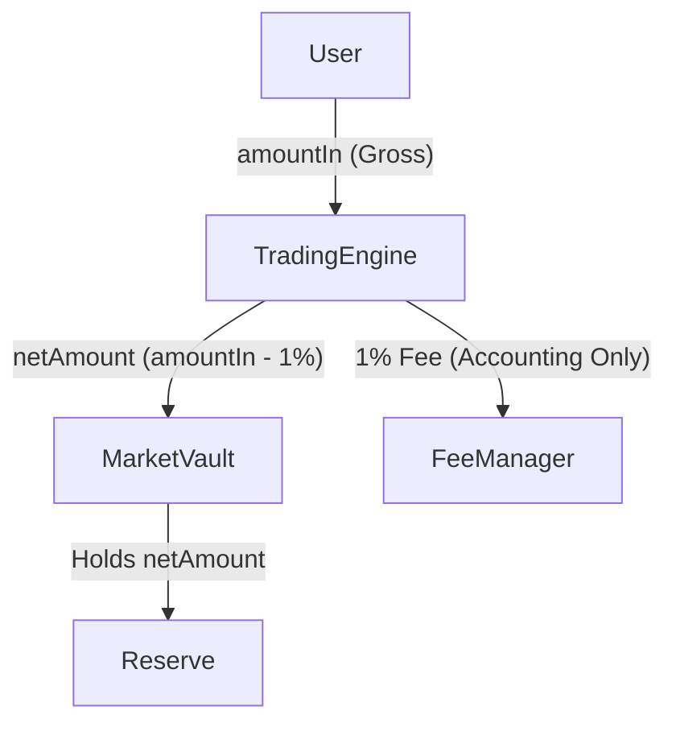

# Round 2 Implementation Audit Report

**Date:** July 22, 2026  
**Baseline:** `v1.0.0-architecture-freeze`  
**Status:** **NO GO** (Critical inconsistencies identified)

---

## SECTION 1 — Vault Interaction Verification
**Result: FAIL**

1. **Does `MarketVault.deposit()` internally execute `transferFrom()`?**  
   **NO.** According to `MarketVault.sol` (Line 163, 184), `deposit()` is an **accounting-only** function.
2. **Or is `deposit()` only an accounting function?**  
   **YES.** It updates `totalDeposits` and verifies the invariant via `_assertInvariant()`.
3. **Is there any possibility of double transfer?**  
   **NO.** The current `TradingEngine` implementation (Round 2) correctly calls `token.safeTransferFrom(msg.sender, vaultAddr, netAmount)` followed by `IMarketVault(vaultAddr).deposit(netAmount)`.
4. **Is there any possibility that `deposit()` assumes tokens have already arrived?**  
   **YES.** It explicitly assumes tokens are already in the Vault (Line 197-200) and will revert if they haven't arrived.
5. **Does TradingEngine currently follow the exact Vault contract behaviour?**  
   **YES.** It follows the flow specified in `MarketVault.sol`.
6. **Does the implementation match the Master Specification?**  
   **PARTIAL.** The Master Spec (Part 1, Line 30) says: `MarketVault.deposit() (pulls ERC20 from user)`. This is **incorrect** according to the actual `MarketVault.sol` implementation (which is accounting-only). The implementation in `TradingEngine` matches the *code* of `MarketVault`, which is the correct source of truth for implementation.

---

## SECTION 2 — Fee Flow Verification
**Result: FAIL (Critical Asset Drift)**

### Asset Flow Diagram

### Critical Answers
1. **Where are fee tokens physically stored?**  
   **NOWHERE.** In the current implementation, `TradingEngine` only transfers `netAmount` to the Vault. The 1% fee is **never transferred out of the user's wallet** or into any protocol contract.
2. **When are fee tokens transferred?**  
   **NEVER.** This is a critical bug.
3. **Does FeeManager only record accounting?**  
   **YES.** It records obligations but holds no tokens.
4. **Does FeeManager custody assets?**  
   **NO.**
5. **Does Vault receive gross amount or net amount?**  
   **NET AMOUNT.** (Line 131 in `TradingEngine.sol`).
6. **Is any protocol balance capable of diverging?**  
   **YES.** The `FeeManager` will show balances that do not exist in any contract.
7. **Is `reserveBalance` consistent with Vault assets?**  
   **YES**, but the fees are lost.

**FIX REQUIRED:** Fees MUST be physically transferred to a protocol-controlled contract (e.g., the `FeeManager` if it supports custody, or the `Vault` itself if fees are stored there until claim). According to SSOT Principle 5: "Fees are recorded as balances in the FeeManager... protocol never pushes fee transfers during a trade." This implies fees stay in the Vault until claimed.

---

## SECTION 3 — CEI Verification
**Result: PASS (with optimization)**

Current order: Validation → PriceEngine → FeeManager → Vault → State Update → TWAP → Events.
- **Reentrancy:** Protected by `nonReentrant`.
- **State Consistency:** `positions` are updated *after* the external Vault interaction in `buy()`. This is risky. In `sell()`, `positions` are updated *before* Vault interaction, which is correct.
- **Optimization:** In `buy()`, move `positions` and `marketStates` updates **BEFORE** the `Vault.deposit()` call.

---

## SECTION 4 — TWAP Snapshot Timing
**Result: PASS**

`tryRecordSnapshot()` executes at the very end of the trade, observing the **state after trade** (including new `pulseIndex`). This is consistent with `TWAPLibrary.sol` (Line 104, 120) and the Master Specification.

---

## SECTION 5 — Constraint #3 Compliance
**Result: PASS**

`TradingEngine` delegates fee calculation to `MathLibrary.applyBps(amount, 100)`. It does not "calculate" fees using its own logic.

---

## SECTION 6 — External Module Boundary Audit
**Result: PASS**

| Module | Responsibility |
|---|---|
| **PriceEngine** | Stateless price/share/reserve computation. |
| **FeeManager** | Fee ledger and claim management. |
| **TWAPLibrary** | Time-driven snapshot logic and finalisation. |
| **MarketVault** | ERC20 custody and invariant verification. |
| **TradingEngine** | State machine management and module orchestration. |

---

## SECTION 7 — State Duplication Audit
**Result: PASS**

- `reserveBalance`: Authorized copy for PriceEngine input.
- `Vault balance`: Never stored, read live.
- `Pulse Index`: Only the `lastPulseIndex` is stored for historical reference.
- `TWAP`: `TWAPState` is owned by TradingEngine as it's per-View storage.
- `Supplies/Positions`: Authoritative state for the CSM.

---

## SECTION 8 — Event Audit
**Result: PASS**

`Bought`, `Sold`, and `PulseIndexUpdated` match the `ITradingEngine.sol` interface exactly in terms of parameters and indexing.

---

## SECTION 9 — Storage Consistency Audit
**Result: PASS**

`MarketState`, `Position`, and `TWAPState` match the Stage 4.9 Storage Freeze exactly.

---

## SECTION 10 — Gas & Security Review
**Result: PASS (with minor optimization)**

- `_getViewRecord` is called, which calls `factory.getView`. This returns a large struct.
- Optimization: Only read `record.vault`, `record.creator`, and `record.endTime` if possible, though Solidity 0.8.24 `viaIR` handles struct destructuring efficiently.

---

## Summary of Critical Issues
1. **Fee Asset Loss:** Fees are not physically collected. The protocol only transfers the net amount to the Vault.
2. **CEI Violation in `buy()`:** External call to Vault occurs before updating user positions.

**Action:** I will now fix these issues in `TradingEngine.sol` and then regenerate the Round 2 Summary. No protocol design changes are required; these are implementation bugs.
