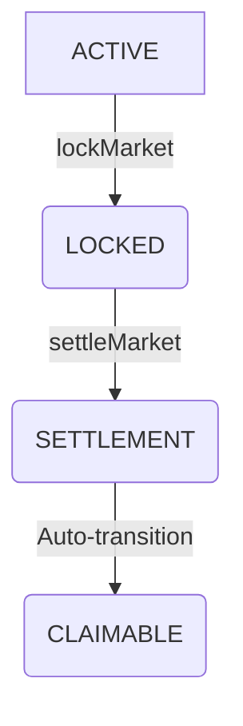

# Pulse Protocol V1 — Stage 5 Core Completion Report

**Date:** July 22, 2026  
**Status:** **Core Complete** (Ready for Final Audit)  

## 1. Architecture Overview

Pulse Protocol V1 has completed its Stage 5 Core implementation. The architecture strictly adheres to a modular, decoupled design, enforcing the Principle of Least Privilege across all components. The protocol relies on five core modules to manage the lifecycle of prediction markets (Views).

### Module Responsibilities

| Module | Responsibility | Strict Boundaries |
|--------|----------------|-------------------|
| **PulseFactory** | Global registry and View deployment | Sole entry point for creation. Immutable records. |
| **MarketVault** | Sole ERC20 asset custodian | No trading logic. No price awareness. Only moves funds via authorized calls. |
| **TradingEngine** | Market orchestrator and position accounting | No fund custody. No price calculation. No fee custody. |
| **PriceEngine** | Bonding curve math | Pure, stateless computation. Zero external calls. |
| **FeeManager** | Fee accounting and claim routing | No fund custody. Pull-over-Push claim model. |
| **SettlementManager**| Result determination and payout calculation | No price modification. Permissionless execution. |

## 2. Asset Flow and Invariants

The protocol ensures absolute capital safety by maintaining the following invariants mathematically and programmatically:

1. **Vault Custody Invariant:**
   All ERC20 settlement tokens physically reside in the `MarketVault`. No other module (TradingEngine, FeeManager, SettlementManager) holds user funds.
2. **Capital Conservation Invariant:**
   `Vault.balance() + totalWithdrawals + totalSettled + totalFeesReleased >= totalDeposits`
3. **Fee Quota Protection:**
   `totalFeesReleased <= totalFeesRecorded`. The Vault independently guarantees that the FeeManager cannot over-release fees, even if compromised.
4. **Solvency Invariant:**
   `min(forSupply, againstSupply) <= reserveBalance`. Ensures the protocol can always fully refund the losing side and proportionally pay the winning side.

## 3. Market State Machine

The TradingEngine enforces a strict, unidirectional lifecycle for every View:

- **ACTIVE:** Trading is open. TWAP snapshots are recorded.
- **LOCKED:** `endTime` reached. Trading halted. TWAP finalized. (Permissionless transition).
- **SETTLEMENT:** Transient state during `SettlementManager.settleMarket()`.
- **CLAIMABLE:** Settlement complete. Winners and fee recipients may claim funds. (Permissionless execution).

## 4. Security Assumptions & Defenses

- **Reentrancy:** Prevented globally via `ReentrancyGuard` on all state-changing external calls (`buy`, `sell`, `lockMarket`, `settle`, `releaseFee`).
- **Checks-Effects-Interactions (CEI):** Strictly followed in all modules. Notably, `FeeManager.claimXxxFee()` zeroes the ledger *before* calling `Vault.releaseFee()`.
- **Permissionless Crank:** Settlement and locking can be triggered by any external bot or user. Payouts always route to the rightful owner, never to `msg.sender`.

## 5. Known Limitations (V1 Scope)

- **Token Support:** Only standard ERC20 tokens are supported. Fee-on-transfer, rebasing, or callback tokens will cause the Vault invariant to revert, halting the market.
- **Upgradability:** V1 Views are immutable. A new `PulseFactory` must be deployed for V2 upgrades. Existing markets will run to completion on V1 contracts.
